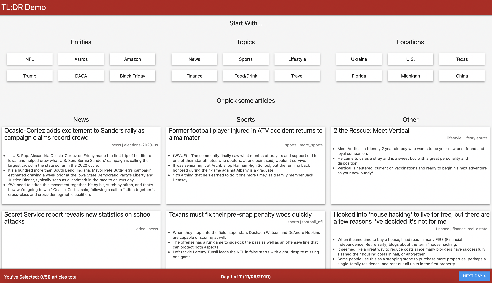

# Evaluation of OCCAMS 

In the creation of a TLDR for Intelligence Analysts, there is a purported value in developing multi-document summarization techniques to support the synthesis and identification of new, relevant information. One such technology, OCCAMS (an Optimal Combinatorial Covering Algorithm for Multi-document Summarization), aims to do just this using statistical techniques with simplistic hyperparameters to define what ‘relevant’ information is.

This repo looks to evaluate the summarization package and explore possible implementation improvements into an [LAS SCADS Demo](https://commander.ncsu-las.net/commander/project/0000017f-0d34-d974-0a00-10e600000013) prototype. 

## OCCAMS 

OCCAMS has continued to be developed at SCADS 2022. The repo can be found at https://github.ncsu.edu/SCADS/Occams. 

Key System Components 

OCCAMS takes a selection of text bodies that form a corpus and summarizes them based on a user designated scheme. Within the corpus, 1 to n **documents** can be present, each comprising of **sentences** to be evaluated for relevance. After tokenizing the corpus, an **Incidence Structure** is generated to hold the listing of sentences in the corpus and their associated term weights. Summaries are extractive; thus, the algorithm ranks sentences based on the scheme provided and then selects the highest weighted sentences for use in a summary. Summaries can then be generated from the Incidence Structure into **Extracts**. These extracts are built using a particular scheme which acts as a heuristic to judge relevance of a sentence. Details regarding the full algorithm are described here: https://ieeexplore.ieee.org/document/6406475. 

Practical support for utilizing OCCAMS and understanding the integrated heuristics can be found [here](OCCAMS_user_guide.md). 

## Summarization Results 

__Single Document Summarization__ 

For the SCADS recommender system demo, single document summarizations (aka highlights) were generated to show an additional aspect of development that occurred during SCADS. 

Each of these highlights are ranked by their 'relevance' in summarizing the information within the document. However, they are noticeably non-sequitur when displayed in a paragraph format. This tends to be the case throughout most generated extractive summaries in produced. OCCAMS doesn't reduce this problem any further. **Summarization for SCADS can be found [here](work.ipynb). 

__Multi-Document Summarization__ 

Despite this implementation, prioritization was placed on identifying if OCCAMS could produce summaries which effectively shared information across different documents. Ideally, corpuses could be clustered, and one summary could be produced that had high coverage of the entire corpus.  Use cases could include summarizing clusters of documents that were recommended or inverting the process to utilize high-scoring summaries as the recommender system’s input to selecting new documents. 

- An example of 3 clustered documents regarding the University of Connecticut's Women's Basketball Team can be found [here](out/uconn.txt)
- An example of 145 clustered documents regarding the basketball player Zion Williamson can be found [here](out/zion.txt). 

__Observations and Goals__

As the number of grouped documents increases, summarization generally declines (although this in part changes when utilizing different OCCAMS schemes as well) The goal was to maximize the size of the document’s clusters and the summarization quality. We looked to produce intuitive summarizations with high, non-duplicative information coverage.  While single document summarization produced less-than-human quality responses, the hope was that the density of the term weight matrix would increase when OCCAMS was provided with more input data. Thus, making multi-document summarization higher quality than single document summarization. 

To effectively identify an optimized corpus size, evaluation criteria were identified. These criteria could be utilized in the future to compare OCCAMS with additional novel summarization techniques. However, while measurements of information gain, coverage and novelty can be taken, no evaluation criteria have been identified to quantify the readability of a particular summary. Human evaluation would still be needed in this regard to identify if a summary of ‘highlights’ would appropriate qualify as a paragraph-based summary. This is hypothesized to be an unachievable goal utilizing extractive text summarization due to its non-generative nature. Abstractive methods can be appealing to overcome this challenge but are frequently disregarded due to hallucinogenic tendencies. 

## Evaluation Criteria 

Primitive evaluation metrics were developed to be used in determining OCCAMS usefulness and capability of being deployed to summarize large corpuses in real time. 

__Utility__ 

One measurement of utility comes from document coverage. Summaries would be expected to return knowledge from across documents while reducing duplicative information shared. To measure coverage, entities (person, organization, location) were extracted from both the document(s) and the associated summary using Spacy’s en_core_web_sm pipeline. A similarity score and average contribution metric were then evaluation. The similarity score identified the entities described within the summary as a fraction of entities available throughout the document(s). Summaries with high similarity scores would intuitively contain a higher amount of information from throughout the document(s). The average contribution metric measured the distribution of entities across the documents. A higher average contribution would point to improved synthesis of information. It is important to note that this contribution metric can be rendered useless if the size of the summary that the user allows is not large enough to grab sentences from each document in the corpus.

Traditional metrics for OCCAMS have previously been evaluated (see https://ieeexplore.ieee.org/document/6406475). Our goal is not to identify a model comparison technique in this experiment, but rather identify attributes of the summary which we can use to determine if the information gain present within a summary is an accurate and usable reflection of the corpus. 

__Feasability & Scalability__ 

The scalability of our summarization model must also be considered. We evaluated OCCAMS to take an average of x length to process the text, and y length to summarize the text of a corpus of length 10. For implementation in interactive applications, there is a need to ensure that any corpus generated (either manually as we did, or automatically through other modelling techniques) is scaled to a size that allows for efficient summarization. 

Excluding the Fisher scheme – which requires the computation of document bigrams to be compared against the bigrams of a background corpus, a time-consuming algorithm which demands precomputing and caching for efficient results – different scheme selections do not drastically change the summarization time. For each summarization task, term weight extraction time and summary extraction time were collected. This effectively breaks up the time that OCCAMS spends in the NLP realm, gathering information regarding the term weights, from the computation time needed to evaluate the relevance of each sentence and rank them for summarization. While efforts can be taken to ensure the precomputing of NLP tasks as new documents are added to the corpus, summarization efforts must take place after the corpus has been finalized. For this reason, the summary extraction time remains as more valuable metric to evaluate feasibility of summarizing a corpus with n documents. 

## Experimentation 

## Results 